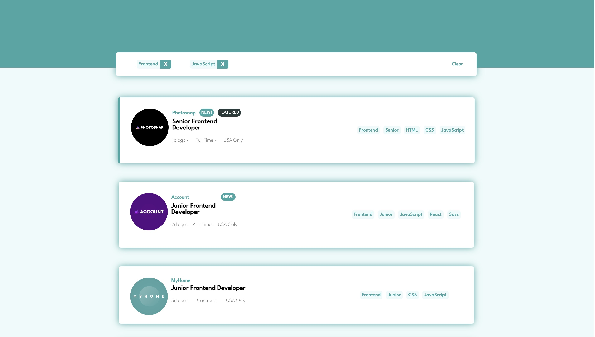

# Mailgun - Frontend Challenge

This is a solution to the Mailgun Frontend Challenge

## Table of contents

- [Overview](#overview)
  - [The challenge](#the-challenge)
  - [Screenshot](#screenshot)
  - [Running The Project](#running-the-project)
- [Useful resources](#useful-resources)
- [Author](#author)

## Overview

### The challenge

Users should be able to:
- View the layout for the site in desktop and/or mobile resolutions
- See hover states for all interactive elements on the page
- Filter job listings based on the categories and see the list update based on filters selected.

### Screenshot

### Built with

- Semantic HTML5 markup
- Flexbox
- Mobile-first workflow
- React hooks
- [React](https://reactjs.org/) - JS library
- [Styled Components](https://styled-components.com/) - For styles

### Running the project
- To set up the application move to the project directory and run `npm i`
- To run the application run `npm start`
- You should see the application running on http://localhost:3000/

### Continued development

- If given more time, I would have hosted this application somewhere like Github Pages. 
- I'd have added some unit testing with something like Jest or React Testing Library.

### Useful resources

- [MDN Array Methods](https://developer.mozilla.org/en-US/docs/Web/JavaScript/Reference/Global_Objects/Array) - I used a few different array methods in this project to get the filters working how I wanted them to and referenced good ole MDN for which to use.
- [React Hooks Docs](https://reactjs.org/docs/hooks-state.html) - Refreshing memory on hooks and which to use for my needs in this project.

## Author

- LinkedIn - [Brooklynn Moor](https://www.linkedin.com/in/brooklynnmoor/)
